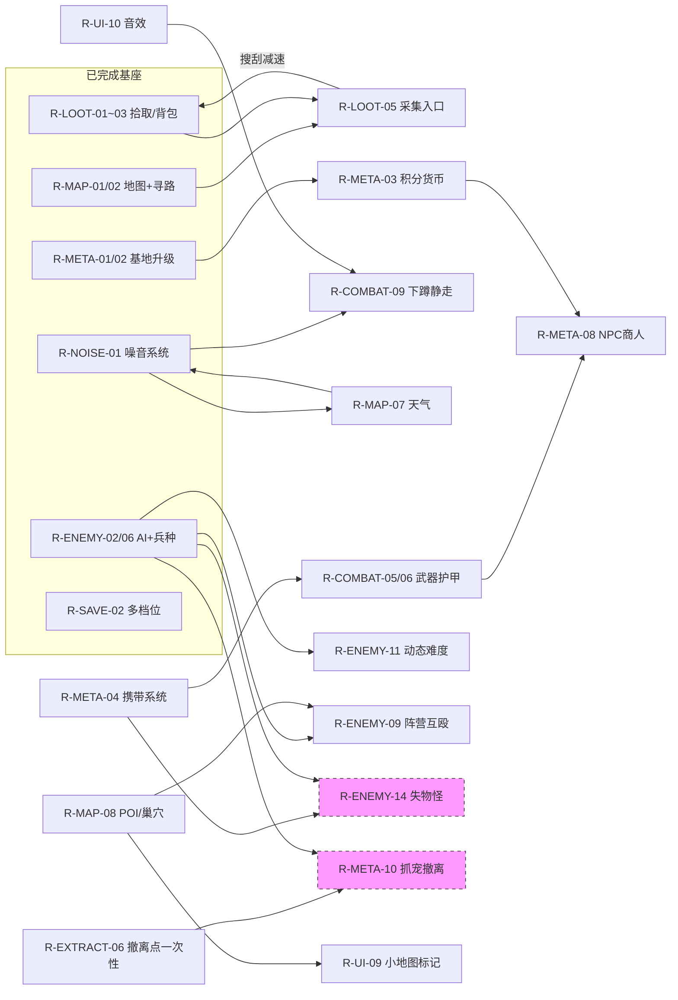

# 03_REQUIREMENTS.md — 需求全景追踪矩阵

> 2026-09-16 生成。整合自 `00_GAME_DESIGN.md`（系统规格 3.1~3.13 + 待回答 21~53）、
> `02_TECH_BUILD.md`（第三部分待办）、`docs/MISSING_ASSETS.md`（素材清单），
> 并对照代码与 git 历史核实了全部存疑项。
>
> **维护规则**：任何设计拍板 / 功能完成 / 状态变化，必须同步更新本文件（见 00 文档铁律第 7 条）。

## 状态图例

| 符号 | 含义 |
| :--- | :--- |
| ✅ | 已完成（代码核实或文档确认） |
| 🔄 | 进行中 / 调参中 |
| ⏳ | 已拍板方向，未实现 |
| ❓ | 待设计（方向未定，见「待拍板」） |
| ⛔ | 被素材/前置需求阻塞 |
| ⚠️ | P0 阻塞项（发布/试玩前必须处理） |

优先级：**P0** 试玩/发布前必须 · **P1** Phase 1 垂直切片验收 · **P2** Phase 2 内容填充 · **P3** 中长期

---

# 一、总览仪表盘

| 模块 | ✅ 完成 | 未完成 | 完成率 | 备注 |
| :--- | :---: | :---: | :---: | :--- |
| 地图生成 MAP | 5 | 4 | 56% | 河水/裂缝调参进行中 |
| 搜刮/采集 LOOT | 4 | 5 | 44% | harvest 接入口是核心缺口 |
| 限时/撤离 SESS+EXTRACT | 5 | 5 | 50% | 受击打断、一次性均未实现 |
| 敌人/生物 ENEMY | 7 | 7 | 50% | 兵种/动物系统 9/16 刚落地 |
| 战斗 COMBAT | 2 | 11 | 15% | 框架完成，扩展全未做 |
| 噪音 NOISE | 2 | 3 | 40% | 逻辑全通，天气联动未做 |
| 生存 SURV | 1 | 1 | 50% | 收支平衡未验证 |
| 局外养成/基地 META | 2 | 9 | 18% | 携带/积分/安全箱全未动 |
| UI/设置/音频 UI | 4 | 7 | 36% | 主菜单/设置/双语 9/16 刚落地 |
| 存档 SAVE | 2 | 1 | 67% | 多档位已实现 |
| 美术素材 ART | 2 | 5 | 29% | 敌人原画管线进行中 |
| 性能/平台 PERF+STEAM | 2 | 3 | 40% | Steam 全未动 |
| **合计** | **38** | **61** | **38%** | 共 99 项 |

⚠️ P0 阻塞项 1 个：**R-SESS-02 `debug.time_scale` 仍为 20.0**（代码实测 config.json:760）。

---

# 二、需求矩阵

## MAP · 地图生成

| ID | 需求 | 状态 | 优先级 | 依赖 | 来源 |
| :--- | :--- | :---: | :---: | :--- | :--- |
| R-MAP-01 | 程序化地图（噪声地形+群系+洪水填充连通性+重生成） | ✅ | — | — | 00 §3.1 |
| R-MAP-02 | 导航网格（AStarGrid2D + 点击寻路） | ✅ | — | — | 00 §3.1 |
| R-MAP-03 | 群系玩法差异（各群系资源产出不同） | ✅ | — | — | 00 §3.1 |
| R-MAP-04 | 地形速度网格（雪原 0.62/浅滩 0.72，敌人生效） | ✅ | — | — | 00 §3.1 |
| R-MAP-05 | 卡树/石头 bug（DecorCollision + 端点吸附） | ✅ | P0 | — | 02 §A.3，commit 323fdc6 已修 |
| R-MAP-06 | 河流/裂缝带宽调参（河 43%→稀长蜿蜒、缝≥0.9 格） | 🔄 | P1 | — | 02 §B |
| R-MAP-07 | 天气系统（局内动态切换、影响噪音、道具可改） | ❓ | P2 | R-NOISE-01 | 00 §3.1，细则=待拍板 26 |
| R-MAP-08 | POI / 地图建筑 / 巢穴（巢穴产怪+拆除奖励） | ❓ | P2 | — | 00 §3.1，细则=待拍板 24 |
| R-MAP-09 | 矿脉反复采集节点（数据已注册） | ⏳ | P1 | R-LOOT-05 | 00 §3.1 |

## LOOT · 搜刮与采集

| ID | 需求 | 状态 | 优先级 | 依赖 | 来源 |
| :--- | :--- | :---: | :---: | :--- | :--- |
| R-LOOT-01 | 自动拾取（半径触发+格满重试+冷却） | ✅ | — | — | 00 §3.2 |
| R-LOOT-02 | 背包格子制（每种 1 格，默认 10） | ✅ | — | — | 00 §3.2 |
| R-LOOT-03 | 资源点生成（密度+稀有度加权+只刷可达格） | ✅ | — | — | 00 §3.2 |
| R-LOOT-03b | 仓库入库规则（20 格/叠加 1000/截断丢弃） | ✅ | — | — | 00 §3.2 |
| R-LOOT-04 | 资源点总量刻意压低（"惊喜"定位） | ⏳ | P1 | — | 00 §3.2 |
| R-LOOT-05 | 采集玩法：harvest() 接交互入口（3D 射线→registry） | ⏳ | P1 | — | 02 §D-A；代码核实：全项目零调用 |
| R-LOOT-06 | 搜刮（拆建筑/采集）时角色减速 | ⏳ | P2 | R-LOOT-05 | 00 §3.8 |
| R-LOOT-07 | 敌人掉落装备/道具类 | ❓ | P2 | R-COMBAT-05 | 00 §3.2 |
| R-LOOT-08 | 拆建筑（POI 可拆，读条/掉落/噪音反馈） | ❓ | P2 | R-MAP-08 | 00 §3.13 |

## SESS / EXTRACT · 限时与撤离

| ID | 需求 | 状态 | 优先级 | 依赖 | 来源 |
| :--- | :--- | :---: | :---: | :--- | :--- |
| R-SESS-01 | 60 分钟倒计时 + HUD 显示 | ✅ | — | — | 00 §3.3 |
| R-SESS-02 | debug.time_scale 调回 1.0 | ⚠️ | **P0** | — | 02 §A.1；代码实测仍为 20.0 |
| R-EXTRACT-01 | 撤离时间轴（30 开 3 / 45、55 各关 1） | ✅ | — | — | 00 §3.4 |
| R-EXTRACT-02 | 选址规则 + 预定关闭顺序 + 关闭保护 | ✅ | — | — | 00 §3.4 |
| R-EXTRACT-03 | 撤离小地图（弹出/警示橙圈闪烁） | ✅ | — | — | 00 §3.4 |
| R-EXTRACT-04 | 站圈 3 秒撤离 + 进度弧脉冲 | ✅ | — | — | 00 §3.4 |
| R-EXTRACT-05 | 撤离被敌人攻击打断并重置 | ⏳ | P1 | — | 00 §3.4；代码核实：extraction_point.gd 无打断逻辑 |
| R-EXTRACT-06 | 每个撤离点只能用一次（为抓宠铺路） | ⏳ | P2 | R-META-10 | 00 §3.4；代码核实：未做消耗 |
| R-EXTRACT-07 | 撤离点关闭前吸引怪物聚集 | ⏳ | P2 | R-ENEMY-02 | 00 §3.4 |
| R-EXTRACT-08 | 撤离瞬间拾取重试窗口的结算规则 | ❓ | P1 | — | 待拍板 38 |

## ENEMY · 敌人与生物

| ID | 需求 | 状态 | 优先级 | 依赖 | 来源 |
| :--- | :--- | :---: | :---: | :--- | :--- |
| R-ENEMY-01 | 敌人生成（数量/距离/去重/只刷可达格） | ✅ | — | — | 00 §3.6 |
| R-ENEMY-02 | AI 巡逻/调查/追击 + 休眠/共享 A*/节流 | ✅ | — | — | 00 §3.6 |
| R-ENEMY-03 | 视野墙体遮挡 + 最后已知位置 | ✅ | — | — | 00 §3.6 |
| R-ENEMY-04 | 击杀掉落（75%/加权 2~6 单位） | ✅ | — | — | 00 §3.6 |
| R-ENEMY-05 | 战争迷雾（探索记忆+视野内显隐） | ✅ | — | — | 00 §3.6 |
| R-ENEMY-06 | 兵种系统（enemy_types 数据驱动+帧序列） | ✅ | — | — | 9/16 代码新增（文档未收录，见漂移清单） |
| R-ENEMY-07 | 动物系统（羊群/惊逃/掉落肉） | ✅ | — | — | 9/16 代码新增（animal.gd/animal_system.gd） |
| R-ENEMY-08 | 正式版 6 种怪玩法差异 + 群系映射表 | ❓ | P2 | R-MAP-03 | 00 §3.6，待拍板 23/49 |
| R-ENEMY-09 | 机械 vs 丧尸阵营互殴（谁近打谁） | ⏳ | P2 | R-ENEMY-06 | 00 §3.6 |
| R-ENEMY-10 | 远程攻击敌人 | ⏳ | P2 | R-ENEMY-06 | 00 §3.6 |
| R-ENEMY-11 | 动态难度（怪死增强剩余敌人，有上限） | ⏳ | P2 | R-ENEMY-06 | 00 §3.6 |
| R-ENEMY-12 | 精英/BOSS 掉落（基础+随机稀有） | ⏳ | P2 | R-ENEMY-04 | 00 §3.6 |
| R-ENEMY-13 | 敌人群体分离（避免挤成一团） | ⏳ | P3 | — | 00 §3.6 |
| R-ENEMY-14 | 失物怪（死亡回收，掉血随机掉落遗失物） | ❓ | P3 | R-ENEMY-06, R-META-04 | 00 §2，待拍板 48，暂不排期 |

## COMBAT · 战斗

| ID | 需求 | 状态 | 优先级 | 依赖 | 来源 |
| :--- | :--- | :---: | :---: | :--- | :--- |
| R-COMBAT-01 | FSM + 三段式攻击 + 受击硬直 + 冲刺 + 伤害管线 | ✅ | — | — | 02 §2 Phase1 |
| R-COMBAT-02 | 技能系统（3 技能）+ 体力循环 | ✅ | — | — | 02 §2 Phase2 |
| R-COMBAT-03 | 攻击/闪避消耗体力 | ⏳ | P1 | R-COMBAT-02 | 00 §3.7 |
| R-COMBAT-04 | 击退不得把敌人推进墙里 | ⏳ | P1 | — | 00 §3.7 |
| R-COMBAT-05 | 武器系统（换武器=换攻击参数） | ❓ | P2 | — | 00 §3.7 |
| R-COMBAT-06 | 护甲/装备防御 | ❓ | P2 | R-COMBAT-05, R-META-04 | 00 §3.7 |
| R-COMBAT-07 | 暴击 | ⏳ | P2 | — | 00 §3.7（管线已留乘数位） |
| R-COMBAT-08 | 投掷物制造噪音引怪 | ⏳ | P2 | R-NOISE-01, R-COMBAT-05 | 00 §3.7 |
| R-COMBAT-09 | 下蹲/静走状态（降脚步噪音） | ⏳ | P1 | R-NOISE-01 | 00 §2 节奏，待拍板 50 |
| R-COMBAT-10 | 钩爪最终机制（拉人/撞墙/跨河） | ❓ | P2 | — | 待拍板 25 |
| R-COMBAT-11 | 消耗品（药水/手雷/陷阱） | ❓ | P2 | R-COMBAT-05 | 00 §3.7 |
| R-COMBAT-12 | 状态效果（燃烧/中毒/泥沼） | ⏸ | P3 | — | 00 §3.7 暂不做 |
| R-COMBAT-13 | 被打断技能扣体力的可见反馈 | ❓ | P3 | — | 待拍板 37 |

## NOISE · 噪音

| ID | 需求 | 状态 | 优先级 | 依赖 | 来源 |
| :--- | :--- | :---: | :---: | :--- | :--- |
| R-NOISE-01 | 噪音系统（广播+衰减+三档阈值+调查+染色反馈） | ✅ | — | — | 00 §3.10 |
| R-NOISE-02 | 声源圆环视觉反馈 | ✅ | — | — | 00 §3.10（2D 主线下正常） |
| R-NOISE-03 | "我被发现了"专属视听反馈 | ⏳ | P2 | R-NOISE-01 | 00 §3.10 |
| R-NOISE-04 | 天气影响噪音传播（雨降/雷掩） | ❓ | P2 | R-MAP-07 | 00 §3.1/3.10 |
| R-NOISE-05 | 环境噪音源（伐木场/碎玻璃）、白噪音掩蔽、动态寻路权重 | ⏳ | P3 | — | 02 §2 噪音原始稿 |

## SURV · 生存

| ID | 需求 | 状态 | 优先级 | 依赖 | 来源 |
| :--- | :--- | :---: | :---: | :--- | :--- |
| R-SURV-01 | 食物/饥饿/H 进食 + HUD 生存栏 | ✅ | — | — | 00 §3.9 |
| R-SURV-02 | 食物收支平衡验证（60/局 vs 每点 10） | ⏳ | P1 | R-LOOT-04 | 00 §3.9，待拍板 39 |

## META · 局外养成与基地

| ID | 需求 | 状态 | 优先级 | 依赖 | 来源 |
| :--- | :--- | :---: | :---: | :--- | :--- |
| R-META-01 | 基地（仓库/雕像/大门 + 按 E 交互 + 面板暂停） | ✅ | — | — | 00 §3.5 |
| R-META-02 | 生存/获取两条升级线（即时生效+存档） | ✅ | — | — | 00 §3.5 |
| R-META-03 | 积分货币（杀怪+生存；死亡低分、撤离翻倍） | ⏳ | P1 | — | 00 §2，细则=待拍板 27 |
| R-META-04 | 携带系统（进局带初始装备/消耗品） | ⏳ | P1 | — | 00 §2 |
| R-META-05 | 保底初始装（回基地自动补发） | ⏳ | P1 | R-META-04 | 待拍板 51 |
| R-META-06 | 安全箱（道具解锁，死亡保留格子） | ⏳ | P2 | R-META-04 | 00 §2 |
| R-META-07 | 建筑自由摆放/慢慢扩建 | ❓ | P3 | — | 00 §3.5 |
| R-META-08 | NPC（商人/任务发布者） | ❓ | P3 | R-META-03 | 00 §3.5 |
| R-META-09 | 基地自动采集建筑 | ❓ | P3 | R-LOOT-05 | 00 §3.13 |
| R-META-10 | 抓宠撤离（可控单位随玩家撤离） | ❓ | P3 | R-EXTRACT-06 | 00 §3.13，需设计稿 |
| R-META-11 | RTS 发育/地形改造 | ❓ | P3 | — | 00 §3.13，需设计稿 |

## UI · 界面与音频

| ID | 需求 | 状态 | 优先级 | 依赖 | 来源 |
| :--- | :--- | :---: | :---: | :--- | :--- |
| R-UI-01 | 局内 HUD（倒计时/体力/技能/生存/背包/结算） | ✅ | — | — | 00 §3.11 |
| R-UI-02 | 主菜单 + 选档进入 | ✅ | — | R-SAVE-02 | 9/16 代码新增（start_menu/slot_panel） |
| R-UI-03 | 设置菜单（音量/键位/分辨率/窗口） | ✅ | — | — | 9/16 代码新增（settings_panel/misc_panel/display_settings） |
| R-UI-04 | 中英文双语 | ✅ | — | — | 9/16 代码新增（language 节点） |
| R-UI-05 | 伤害飘字/敌人血条（默认关，设置可开） | ⏳ | P2 | R-UI-03 | 00 §3.8/3.11 |
| R-UI-06 | 命中停顿 | ⏳ | P2 | — | 00 §3.8 |
| R-UI-07 | 屏幕震动 | ⏳ | P2 | — | 00 §3.8 |
| R-UI-08 | 结算面板明细字段 | ❓ | P2 | — | 待拍板 31 |
| R-UI-09 | 小地图资源/敌人/噪音标记 | ⏳ | P2 | R-MAP-08 | 00 §3.11 |
| R-UI-10 | BGM + 音效（Audio 目前空目录） | ⏳ | P1 | — | 02 §D-B，清单=待拍板 32 |
| R-UI-11 | 手柄支持 | ❓ | P3 | — | 待拍板 33 |

## SAVE · 存档

| ID | 需求 | 状态 | 优先级 | 依赖 | 来源 |
| :--- | :--- | :---: | :---: | :--- | :--- |
| R-SAVE-01 | 单档存档（bank+等级） | ✅ | — | — | 00 §3.5 |
| R-SAVE-02 | 多档位存档（6 槽） | ✅ | — | — | 9/16 代码新增（save_slots.gd） |
| R-SAVE-03 | 旧档版本迁移策略 | ❓ | P2 | — | 待拍板 30 |

## ART · 美术素材

| ID | 需求 | 状态 | 优先级 | 依赖 | 来源 |
| :--- | :--- | :---: | :---: | :--- | :--- |
| R-ART-01 | 地形图集/装饰/水面（Tiny Swords CC0） | ✅ | — | — | MISSING_ASSETS §一 |
| R-ART-02 | 玩家序列帧（TS 风格 192px） | ✅ | — | — | commit ba7d5ea |
| R-ART-03 | 敌人原画接入管线（images/ 40 张→抠图→派生帧→接线） | 🔄 | P2 | R-ENEMY-06 | 02 §C（enemy_types 已用 TS 兵种，原画组待并入） |
| R-ART-04 | P0 占位素材替换（铁矿脉/油田/油桶，见清单） | ⏳ | P2 | — | MISSING_ASSETS §二 |
| R-ART-05 | Loot/建筑/UI 正式美术 | ⛔ | P2 | — | 02 §D-C，目录全空 |
| R-ART-06 | 基地地板/墙体正式美术 | ⏳ | P2 | — | 02 §D-B |
| R-ART-07 | 玩家 attack/dodge/hit/dead 序列帧 | ⏳ | P2 | R-ART-02 | 02 §D-A（现走程序化形变） |

## PERF / STEAM · 性能与平台

| ID | 需求 | 状态 | 优先级 | 依赖 | 来源 |
| :--- | :--- | :---: | :---: | :--- | :--- |
| R-PERF-01 | 100 敌人性能方案（休眠+共享网格+节流） | ✅ | — | — | 00 §3.6 |
| R-PERF-02 | 渲染后端定稿（Forward+ + MSAA/AF） | ✅ | — | — | commit eba1860，待拍板 35 可关闭 |
| R-PERF-03 | 最低配置目标 | ❓ | P2 | — | 待拍板 36 |
| R-STEAM-01 | Steam 成就 | ❓ | P3 | — | 待拍板 53 |
| R-STEAM-02 | 云存档（per-slot 策略） | ❓ | P3 | R-SAVE-02 | 待拍板 53 |

---

# 三、依赖关系图

只画**跨模块**的强依赖（A ← B 表示 B 依赖 A）。模块内部依赖已在矩阵列出。

虚线粉色 = 暂不排期的远期项。关键路径：**采集入口 → 基地经济闭环**；**噪音 → 潜行节奏（下蹲/天气/投掷）**；**携带 → 装备 → 失物怪/NPC**。

---

# 四、建议执行路线

按依赖拓扑 + 优先级排序（同一阶段内可并行）：

**第 0 步 · P0 清障（试玩前）**
1. R-SESS-02 time_scale → 1.0
2. R-MAP-06 河水/裂缝调参收尾（02 §B 建议值已给）
3. R-EXTRACT-05 撤离受击打断（改动小、影响核心循环）

**第 1 阶段 · Phase 1 收尾（P1）**
4. R-COMBAT-09 下蹲/静走（"Keep Quiet"的玩法承诺）
5. R-COMBAT-03 攻击/闪避耗体力 + R-COMBAT-04 击退防进墙
6. R-LOOT-05 采集接入口 + R-MAP-09 矿脉 + R-LOOT-04 资源点压低 + R-SURV-02 食物平衡（一组数值联动，一起调）
7. R-META-04 携带系统 + R-META-05 保底初始装
8. R-META-03 积分货币（先拍板待回答 27）
9. R-UI-10 音效（先给打击/拾取/警报三类最小集）

**第 2 阶段 · Phase 2 内容（P2）**
10. R-ENEMY-08 六怪映射（拍板 23/49）→ R-ENEMY-09 阵营互殴 → R-ENEMY-10 远程 → R-ENEMY-11 动态难度 → R-ENEMY-12 精英掉落
11. R-COMBAT-05 武器 → R-COMBAT-06 护甲 → R-COMBAT-07 暴击 → R-COMBAT-08 投掷物 → R-COMBAT-11 消耗品
12. R-MAP-07 天气（拍板 26）+ R-NOISE-04 联动
13. R-MAP-08 POI/巢穴（拍板 24）→ R-LOOT-08 拆建筑 → R-UI-09 小地图标记
14. 手感包：R-UI-05 飘字 + R-UI-06 命中停顿 + R-UI-07 震屏 + R-NOISE-03 发现反馈
15. 美术：R-ART-03 敌人原画并入 + R-ART-04/05/06/07 占位替换

**第 3 阶段 · 中长期（P3，先出设计稿）**
16. R-EXTRACT-06 撤离点一次性 → R-META-10 抓宠撤离
17. R-ENEMY-14 失物怪（拍板 48）
18. R-META-06 安全箱 → R-META-07 自由摆放 → R-META-08 NPC → R-META-09 自动采集
19. R-META-11 RTS 发育
20. R-STEAM-01/02 成就+云存档（拍板 53）、R-PERF-03 最低配置

---

# 五、待拍板清单（阻塞关系标注）

| # | 问题 | 阻塞的需求 |
| :--- | :--- | :--- |
| 21 | 资源 `value` 字段去留 | R-META-08 NPC |
| 23 | 6 种怪玩法差异 | R-ENEMY-08 |
| 24 | 巢穴设计 | R-MAP-08, R-ENEMY-08 |
| 25 | 钩爪最终机制 | R-COMBAT-10 |
| 26 | 天气数值/道具 | R-MAP-07, R-NOISE-04 |
| 27 | 积分细则（给分/双货币面板） | R-META-03 |
| 28 | 撤离速度下限 | R-META-02 数值 |
| 29 | "资源发现概率"改哪个参数 | R-META-02 数值 |
| 30 | 旧档迁移策略 | R-SAVE-03 |
| 31 | 结算面板字段 | R-UI-08 |
| 32 | 音效清单 | R-UI-10 |
| 33 | 手柄支持 | R-UI-11 |
| 36 | 最低配置目标 | R-PERF-03 |
| 37 | 打断技能反馈 | R-COMBAT-13 |
| 38 | 撤离瞬间拾取结算 | R-EXTRACT-08 |
| 39 | 食物收支平衡 | R-SURV-02 |
| 48 | 失物怪细则 | R-ENEMY-14 |
| 49 | 怪×群系映射表 | R-ENEMY-08 |
| 50 | 下蹲数值（噪音/体力/按键） | R-COMBAT-09 |
| 51 | 保底初始装内容 | R-META-05 |
| 52 | 抓宠/RTS 排期 | R-META-10/11 |
| 53 | Steam 成就+云档结构 | R-STEAM-01/02 |

（34/35 已由代码核实关闭：3D 迁移暂停、渲染后端已定 Forward+。）

---

# 六、文档-代码漂移清单（2026-09-16 核实）

00/02 文档落后于代码一天，以下事实**文档尚未收录**，后续更新 00 时并入：

1. **主场景回退 2D**：`project.godot` 主场景现为 `Scenes/StartMenu.tscn`，菜单进 `Scenes/Main.tscn`（2D）。02 文档"3D 唯一入口 Main3D"已不成立，3D 轨道暂停。
2. **Autoload 新增 2 个**：`SaveSlots`、`DisplaySettings`（02 表格只列了 4 个）。
3. **9/16 新落地系统**（00/02 均标"待实现"但实际已完成）：主菜单、设置面板、中英文、多档位存档、兵种系统（enemy_types）、动物系统（animals）。
4. **卡树 bug 已修**（02 §A.3 仍标"未修"）：commit 323fdc6，DecorCollision + 端点吸附 + probe_stuck 7 断言。
5. **渲染后端已定**（待回答 35 可关闭）：commit eba1860 切 Forward+ + MSAA/AF。
